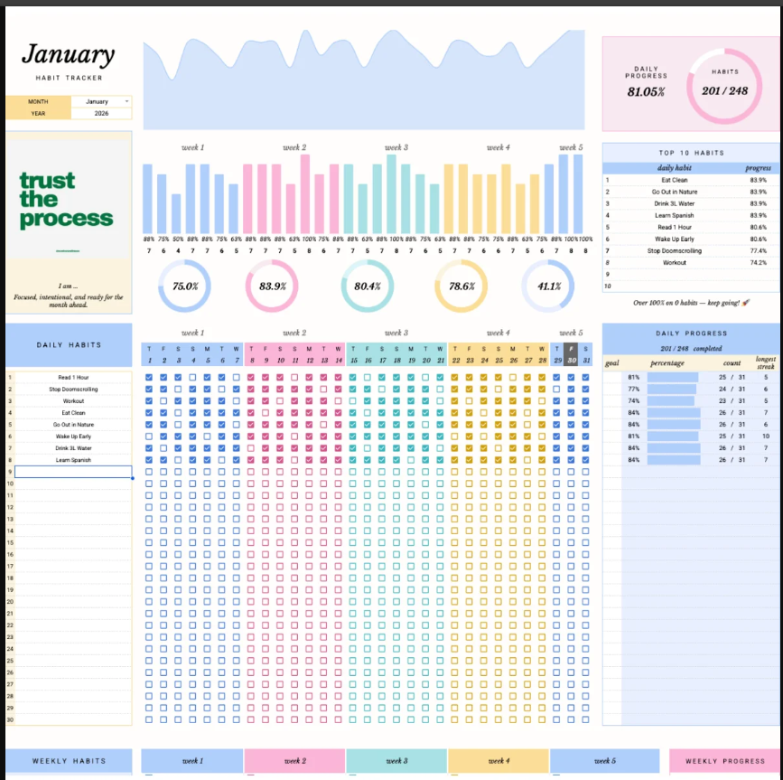
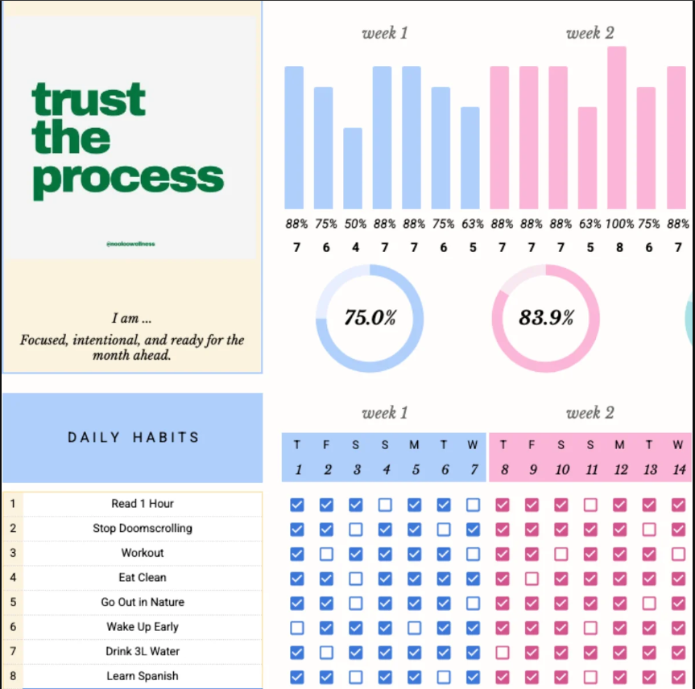
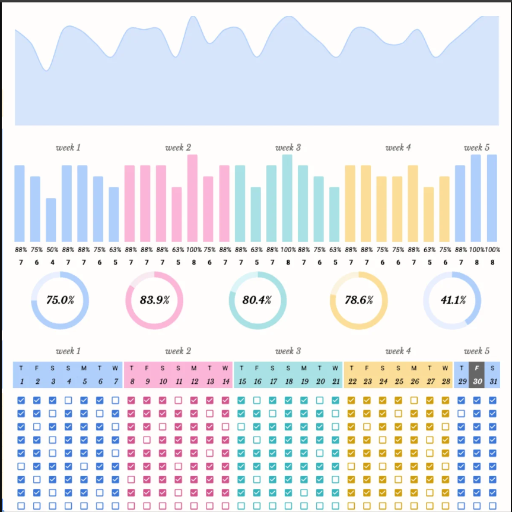
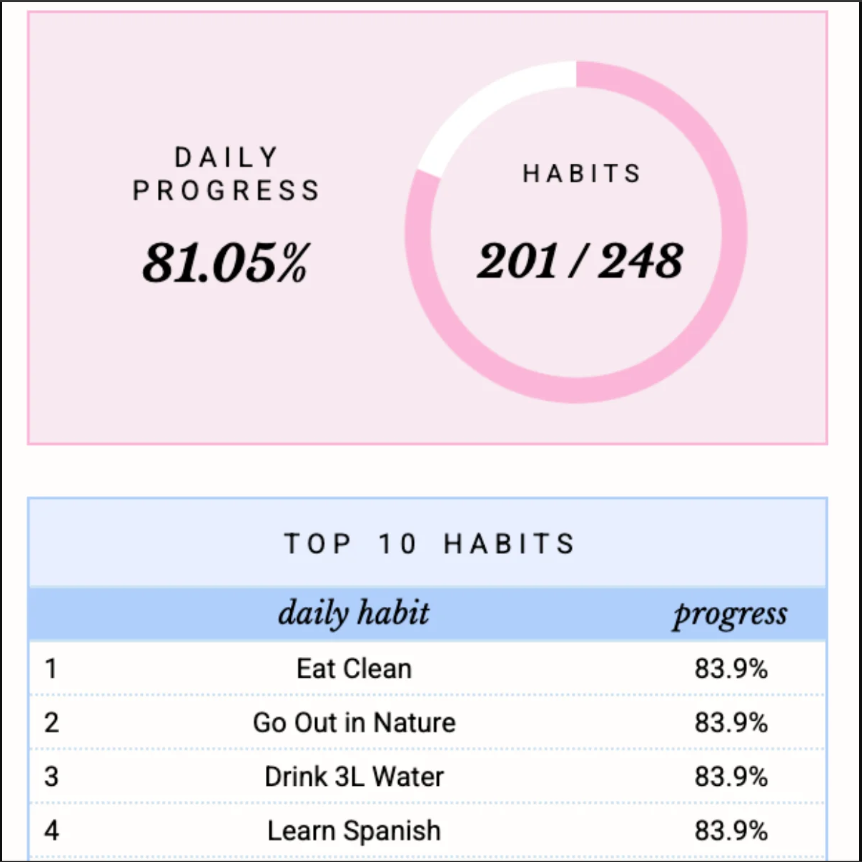

# 📊 ROBUST Habit Tracker

A premium, light-themed, spreadsheet-aligned habit tracking application designed to help users build, sustain, and analyze long-term routines. Built with **React**, **TypeScript**, **Tailwind CSS**, and backed by **Supabase** for real-time cloud synchronization and secure user authentication.

[](#-tech-stack--architecture)
[](#)
[](#)

---

## ❌ The Problem

Building new habits is notoriously difficult, but maintaining consistency is even harder. Traditional habit trackers suffer from several critical shortcomings:
*   **The "Cold Start" Friction**: Setting up routines is often cumbersome, requiring tedious configurations.
*   **Lack of Actionable Insights**: Most trackers only show simple calendar checkmarks without explaining trend lines, weekend behavioral patterns, or habit categories.
*   **Discouragement from Broken Streaks**: Life happens, and losing a long-running streak due to a single missed day can completely destroy motivation.
*   **Siloed Device Caching**: Local-storage-only applications trap your hard-earned progress on a single browser or device, making it impossible to stay accountable on the go.

---

##  The Solution: **ROBUST**

**ROBUST** solves these pain points by combining structured spreadsheet clarity with modern gamification mechanics and secure, real-time cloud backups:
*   **Spreadsheet-Style 31-Day Matrix**: An intuitive, clear grid that provides an instant visual overview of your monthly consistency.
*   **Virtual Item Shop & Streak Freezes**: Earn Experience Points (XP) by completing habits, and spend them on "Streak Freezes" to protect your progress when you need a break.
*   **Supabase Real-Time Sync**: Create an account in seconds to seamlessly sync your habits, streaks, and shop inventory across all devices.
*   **Sunday Reflection Journals**: A structured weekly reflection modal to review achievements, write thoughts, and set intentions for the upcoming week.
*   **Granular Customization**: Track habits with binary checkmarks or numeric values (e.g., liters of water, kilometers run, hours studied).

---

## 👥 Who Can Use ROBUST?

*   **Students & Academics**: Track study hours, assignment goals, and reading habits with numeric tracking.
*   **Developers & Creators**: Monitor coding streaks, commit goals, and creative blocks while earning XP.
*   **Fitness & Health Enthusiasts**: Log daily hydration, step counts, workouts, and sleep consistency.
*   **Anyone seeking lifestyle transformations**: Break bad habits and form positive, rewarding daily structures with visual, gamified feedback.

---

## 📸 UI & User Experience Showcase

### 1. Unified Daily Dashboard
Get a complete birds-eye view of your daily checklist, category breakdown, virtual profile level, and active streak freezes.


### 2. Multi-Dimensional Analytics Board
Understand your routine trends with custom area charts, weekly progress rings, category breakdowns, and weekend consistency analysis.


### 3. Gamification Shop & Milestone Achievements
Earn XP for completing routines, climb to higher profile levels, and unlock milestone badges to celebrate consistency. Spend your XP in the Shop to purchase protective Streak Freezes.


### 4. Seamless User Sign-Up & Sync Options
Sign up in seconds to secure your data. Guest users can start immediately and migrate their local data to the cloud seamlessly upon creating an account.


---

## 💎 Key Features

*   **31-Day Spreadsheet Grid Matrix**: A dense, grid-based visualization of your current month’s completions.
*   **Dynamic XP & Leveling System**: Gain XP for completing routines, with customized XP gains for numeric milestones.
*   **Virtual Shop**: Buy "Streak Freezes" using accumulated XP to protect your active streaks during busy periods.
*   **Custom Goal Configurations**: Define custom category icons, target completion values (e.g., 80% goal rates), and tracking units.
*   **Sunday Journaling**: Interactive weekly journal prompts that unlock on Sundays, helping you review your focus and goals.
*   **Automatic Offline Caching**: Complete data local-first responsiveness that syncs to Supabase instantly when online.

---

## 🛠️ Tech Stack & Architecture

*   **Frontend Framework**: [React 18](https://react.dev/) with [TypeScript](https://www.typescriptlang.org/)
*   **Build Tooling**: [Vite](https://vitejs.dev/)
*   **Styling & Themes**: [Tailwind CSS](https://tailwindcss.com/) for fluid, custom layout structures
*   **Icons**: [Lucide React](https://lucide.dev/)
*   **Data Visualization**: [Recharts](https://recharts.org/) for clean, responsive trend lines and progress rings
*   **Backend Database & Auth**: [Supabase](https://supabase.com/) (PostgreSQL + Gotrue Authentication)

---

## 🚀 Getting Started & Installation

Follow these steps to run the application locally on your machine:

### 1. Clone the Repository
```bash
git clone https://github.com/Raushankumar0720/habit_tracker.git
cd habit_tracker
```

### 2. Install Dependencies
```bash
npm install
```

### 3. Set Up Environment Variables
Create a `.env` file in the root directory of the project and insert your Supabase credentials:
```env
VITE_SUPABASE_URL=https://your-project-id.supabase.co
VITE_SUPABASE_ANON_KEY=your-supabase-anonymous-key
```

### 4. Run the Development Server
```bash
npm run dev
```
Open [http://localhost:5173](http://localhost:5173) in your browser to interact with the application.

---

## 🗃️ Supabase Database Schema

To set up your Supabase database, execute the following SQL schema in the **Supabase SQL Editor**:

```sql
-- 1. Create Profiles table
CREATE TABLE profiles (
  id UUID REFERENCES auth.users ON DELETE CASCADE PRIMARY KEY,
  streak_freezes INT DEFAULT 2,
  spent_xp INT DEFAULT 0,
  accountability_mode BOOLEAN DEFAULT FALSE
);

-- 2. Create Habits table
CREATE TABLE habits (
  id UUID DEFAULT gen_random_uuid() PRIMARY KEY,
  user_id UUID REFERENCES auth.users ON DELETE CASCADE,
  name TEXT NOT NULL,
  description TEXT,
  category TEXT NOT NULL,
  frequency TEXT NOT NULL,
  type TEXT NOT NULL,
  tracking_type TEXT NOT NULL,
  target_value NUMERIC,
  unit TEXT,
  archived BOOLEAN DEFAULT FALSE,
  icon TEXT NOT NULL,
  goal_percent INT DEFAULT 80,
  created_at DATE NOT NULL DEFAULT CURRENT_DATE
);

-- 3. Create History table
CREATE TABLE history (
  id UUID DEFAULT gen_random_uuid() PRIMARY KEY,
  user_id UUID REFERENCES auth.users ON DELETE CASCADE,
  habit_id UUID REFERENCES habits ON DELETE CASCADE,
  date_str DATE NOT NULL,
  completion_value JSONB,
  completed BOOLEAN DEFAULT FALSE,
  xp_gained INT DEFAULT 0,
  streak_freeze_used BOOLEAN DEFAULT FALSE,
  UNIQUE(habit_id, date_str)
);

-- 4. Create Reflections table
CREATE TABLE reflections (
  id UUID DEFAULT gen_random_uuid() PRIMARY KEY,
  user_id UUID REFERENCES auth.users ON DELETE CASCADE,
  week_start_date DATE NOT NULL,
  focus_score INT NOT NULL,
  accomplishment TEXT,
  struggle TEXT,
  adjustment TEXT,
  created_at TIMESTAMP WITH TIME ZONE DEFAULT timezone('utc'::text, now()) NOT NULL,
  UNIQUE(user_id, week_start_date)
);

-- Enable Row Level Security (RLS) for all tables
ALTER TABLE profiles ENABLE ROW LEVEL SECURITY;
ALTER TABLE habits ENABLE ROW LEVEL SECURITY;
ALTER TABLE history ENABLE ROW LEVEL SECURITY;
ALTER TABLE reflections ENABLE ROW LEVEL SECURITY;

-- Create policies so users can only access their own data
CREATE POLICY "Users can manage their own profile" ON profiles
  FOR ALL USING (auth.uid() = id);

CREATE POLICY "Users can manage their own habits" ON habits
  FOR ALL USING (auth.uid() = user_id);

CREATE POLICY "Users can manage their own history" ON history
  FOR ALL USING (auth.uid() = user_id);

CREATE POLICY "Users can manage their own reflections" ON reflections
  FOR ALL USING (auth.uid() = user_id);
```

---

## 📄 License

Distributed under the MIT License. See `LICENSE` for more information.
